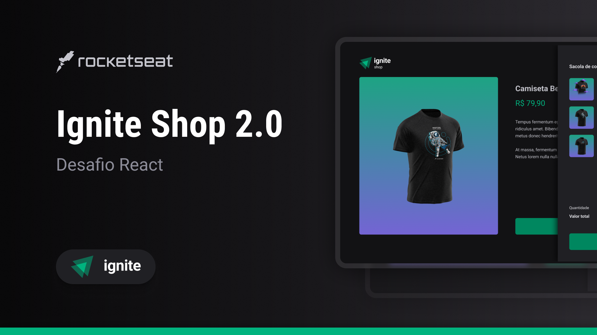

<div align="center">
    
    <p>A fullstack web application for purchasing multiple products using Stripe</p>
</div>



## 💻 Overview
This application was developed as challenge of Ignite program by RocketSeat. The Ignite Shop app is a simple example of a web application to purchasing multiple products using Stripe and NextJS

[](https://www.figma.com/file/8paDXN0LDhmM3TXaxDWBMy/Ignite-Shop-2.0-%E2%80%A2-Desafio-React-(Copy)?type=design&node-id=2%3A12&mode=design&t=uFT8aGHG1qFgJO0e-1)

## ✅ Features

- [x] List products created at Stripe
- [x] Add and remove items to cart
- [x] Buy cart items and pay using Stripe

## 🚀 Tech Stack

The following tools were used in the construction of the project:

<code></code>
<code></code>
<code></code>
<code></code>
<code></code>
<code></code>

## 👉 Run project
Before you begin, you will need to have the following tools installed on your machine:
[Git](https://git-scm.com), [npm](https://www.npmjs.com/)
In addition, it is good to have an editor to work with the code like [VSCode](https://code.visualstudio.com/).

```bash

# Copy enviroment variables
$ cp .env.example .env

# Clone this repository
$ git clone https://github.com/KassiaMabily/ignite-shop.git

# go to the project folder
$ cd ignite-shop

# install dependencies
$ npm i

# run
$ npm run dev

```
